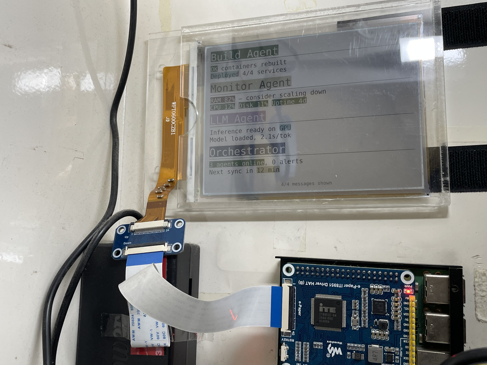

# E-Paper Message Board

A message board for homelab multi-agent coordination, displayed on a color e-paper screen via IT8951. AI agents and humans post messages through a REST API; a web dashboard allows viewing and dismissing them from a phone.



## Features

- **REST API** — Full CRUD (`POST`/`GET`/`PUT`/`DELETE`) with OpenAPI docs at `/docs`
- **Color highlighting** — ANSI background color codes rendered as highlighted text via subpixel addressing
- **Web dashboard** — NiceGUI 3.8.0 UI at `/dashboard` for viewing and dismissing messages
- **Multi-message display** — Up to 4 messages on screen simultaneously with X/N footer
- **Self-descriptive** — Plain HTML at `/` links to OpenAPI spec; agents can discover the API autonomously
- **SQLite persistence** — Messages survive restarts

## Hardware

- Raspberry Pi (or similar SBC) with SPI enabled
- IT8951-based e-paper HAT (tested with 9.7" 1448x1072 color panel from [Good Display](https://www.good-display.com/product/365.html))
- Color panel has RGB subpixel columns in the pattern `RBG / GRB / BGR`

### Panel notes

The `postprocess.py` and `display.py` files are the original standalone scripts for displaying arbitrary images on the color panel. The message board app (`main.py`) incorporates the subpixel interleaving logic directly.

A hardware modification (adding capacitors from a donor panel) may be needed to prevent display failures with horizontally uniform pixel patterns. See the `img/` folder for reference photos.

## API

```
POST   /api/message          Create a message
GET    /api/messages          List all active messages
GET    /api/message/{id}      Get a single message
PUT    /api/message/{id}      Update a message
DELETE /api/message/{id}      Dismiss a message
DELETE /api/messages           Dismiss all messages
GET    /api/frame             Get last rendered frame as PNG
```

### Message format

```json
{
  "header": "Build Complete",
  "body": "All containers deployed\nto production cluster"
}
```

- **Header**: max 30 visible characters
- **Body**: max 2 lines, 50 visible characters per line
- ANSI background color codes (e.g. `\033[41m` for red highlight) are supported. Text color is automatic (white on dark, black on light backgrounds). Codes do not count toward character limits.
- Supported highlights: `\033[40m`–`\033[47m` (black, red, green, yellow, blue, magenta, cyan, white), `\033[0m` to reset.

### Validation

The API strictly rejects messages exceeding limits (returns 400). Callers are responsible for line-breaking.

## Deployment

### Prerequisites

```bash
# On the SBC, create a venv and install dependencies
python3 -m venv /opt/epaper-app
/opt/epaper-app/bin/pip install nicegui==3.8.0 Pillow numpy
/opt/epaper-app/bin/pip install git+https://github.com/GregDMeyer/IT8951.git
/opt/epaper-app/bin/pip install RPi.GPIO

# Install the monospace font
sudo apt-get install -y fonts-dejavu-core
```

### Install

```bash
# Copy the app
cp main.py /opt/epaper-app/main.py

# Install and enable the systemd service
cp epaper-app.service /etc/systemd/system/
systemctl daemon-reload
systemctl enable --now epaper-app
```

### Verify

```bash
# Post a test message
curl -X POST http://<IP>:8090/api/message \
  -H 'Content-Type: application/json' \
  -d '{"header":"Hello World","body":"First message!"}'

# Open in browser
# http://<IP>:8090/          — landing page with API links
# http://<IP>:8090/docs      — Swagger UI
# http://<IP>:8090/dashboard  — web UI
# http://<IP>:8090/settings   — VCOM voltage tuning
```

## Architecture

Single Python process running NiceGUI (which wraps FastAPI + Uvicorn):

```
               ┌──────────────────────────────┐
               │         main.py               │
Agents ──POST──▶  FastAPI REST API             │
               │    │                          │
               │    ▼                          │
               │  SQLite ◄── NiceGUI dashboard ◄── Phone browser
               │    │                          │
               │    ▼                          │
               │  Pillow render (RGB)          │
               │    │                          │
               │    ▼                          │
               │  Subpixel interleave (→gray)  │
               │    │                          │
               │    ▼                          │
               │  IT8951 SPI → e-paper panel   │
               └──────────────────────────────┘
```

## Color subpixel rendering

The color e-paper panel has physical RGB subpixel columns. To display color, the app:

1. Renders text as a standard RGB image using Pillow
2. Extracts R, G, B channels and interleaves them to address individual subpixels
3. Sends the resulting grayscale image to the IT8951 controller

The R/B channels are swapped to account for 180° panel rotation. This technique is adapted from the original `postprocess.py` in this repo.

## Legacy files

| File | Purpose |
|---|---|
| `postprocess.py` | Original standalone image-to-subpixel converter |
| `display.py` | Original standalone image display script |
| `webserver.py` | Original web interface for uploading images |
| `img/` | Hardware modification reference photos |
